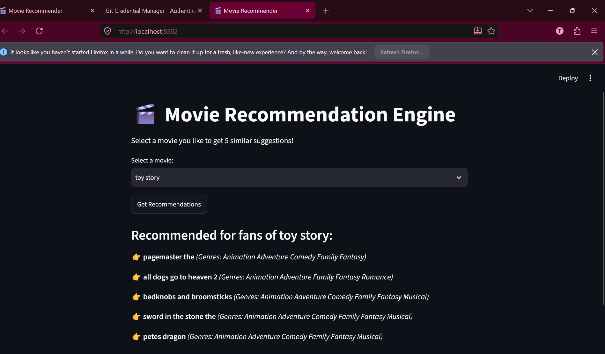

# Movie Recommendation Engine

The Movie Recommendation Engine is a content-based web application that suggests movies to users based on item attributes (such as genres, tags, or plot descriptions). Built using **Python**, **Pandas**, **Scikit-Learn**, and **Streamlit**, it converts unstructured textual movie metadata into mathematical vectors and uses similarity metrics to recommend titles closely related to a user's selection.

---

## 🏗️ Core Architecture & Data Pipeline

The system operates across a 4-stage pipeline:

```text
[ Raw CSV Data ] ➡️ [ Data Preprocessing ] ➡️ [ Feature Extraction (TF-IDF) ]
                                                            │
                                                            ▼
[ Streamlit Web UI ] ⬅️ [ Top-N Ranking ] ⬅️ [ Cosine Similarity Matrix ]

Data Ingestion & Preprocessing
Dataset: movielens_100k.csv contains movie metadata including unique identifiers, titles, and content attributes (genres/tags).

Cleaning: Pandas processes the dataset to remove null values, clean formatting, and combine metadata fields into a unified text feature string per movie.

2. Text Feature Extraction (TF-IDF Vectorization)
Computers cannot directly evaluate textual titles or genres, so text must be converted into numerical representations using TF-IDF (Term Frequency-Inverse Document Frequency):

Term Frequency (TF): Measures how frequently a word appears in a specific movie's metadata.

Inverse Document Frequency (IDF): Measures how common or rare a word is across the entire dataset.

Scikit-Learn's TfidfVectorizer transforms the dataset into a high-dimensional numerical matrix where each row represents a movie and each column represents a weighted term score.

3. Similarity Calculation (Cosine Similarity)
To determine how similar two movies are, the system calculates the angle between their high-dimensional vector representations using Cosine Similarity:

Score = 1.0: Perfect similarity (identical content features).

Score = 0.0: No similarity (completely distinct attributes).

 ## ⚙️ How to Run Locally

1. **Install dependencies:**
```bash
pip install -r requirements.txt

streamlit run app.py

### THE FINAL OUTPUT




  
